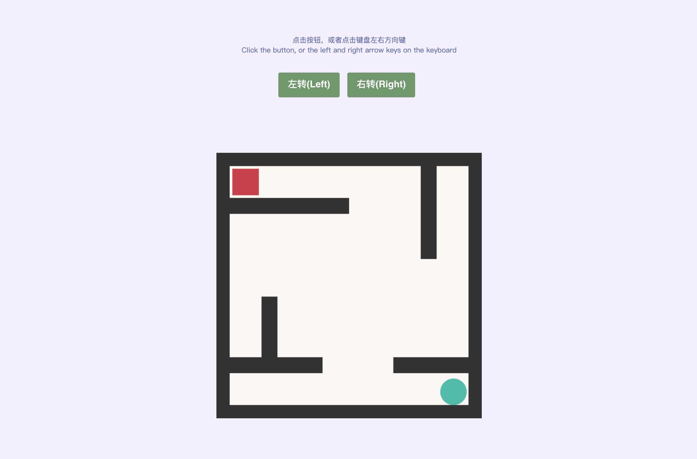
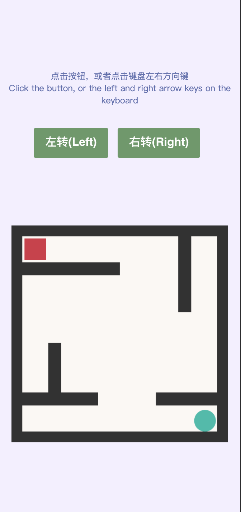

# 基于MatterJs 实现的旋转小游戏

> 该项目仅为学习 MatterJs.

### demo

- [matter-js-rotate-game](https://matter-js-rotate-game.now.sh/)

### 使用

```sh
# clone
git clone https://github.com/side-pocket/matterJs-rotate-game.git

# yarn 
cd matterJs-rotate-game
yarn 

# run
yarn dev
```


### 截图

#### pc 



#### native



